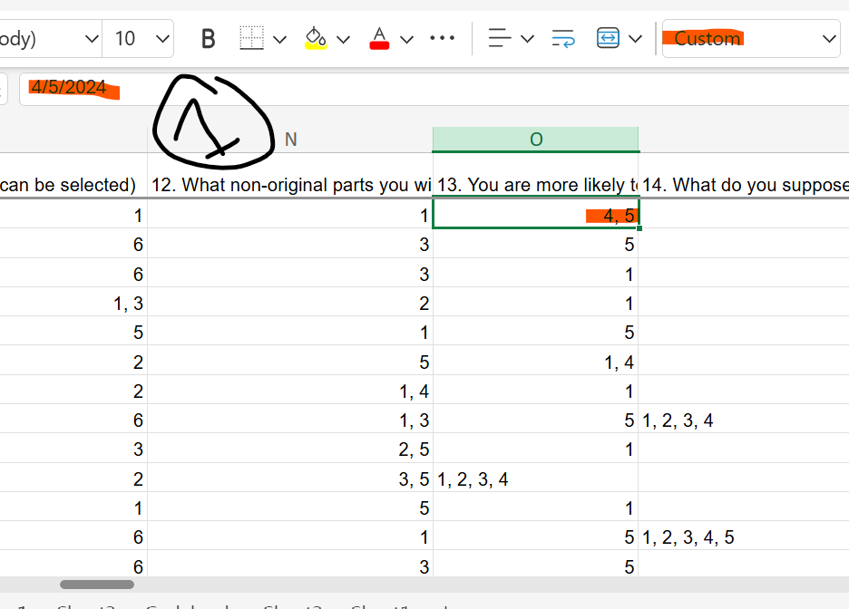
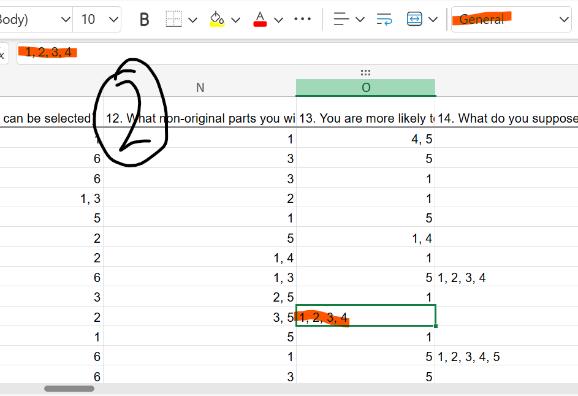
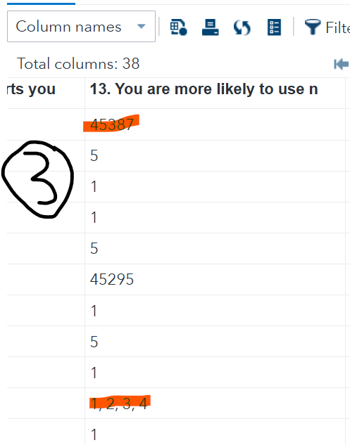
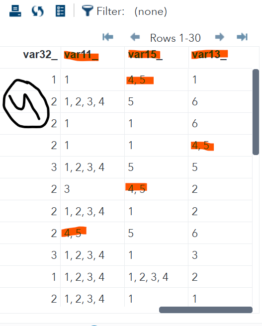

### This paper for SAS and Excel use.

SAS version and info: 

```
Release: 3.81 (Enterprise Edition)
Supported browsers:
- Microsoft Internet Explorer 11
- Mozilla Firefox 21+
- Google Chrome 27+
- Apple Safari 6.0+ (on Apple OS X)
Build date: 27 Apr 2022 13:21:36  
SAS release: 9.04.01M7P08062020  
SAS platform: Linux LIN X64 5.14.0-284.30.1.el9_2.x86_64  
Site name: SAS ONDEMAND FOR ACADEMICS  
Site number:70094220
```

I use SAS OnDemand for Academics in MSEdge prowser.

Excel:

```
Microsoft 360 for web (useing My free email account).
```

The weakness in thes paper is: 

        1- Codes are not coded professionally, i just gave idea that i have.

        2- These codes may be have simple alternative solutions  that i don't know.

        3- I'm beginner programmer. (and not native english to drive clear explanations about my ideas of these codes, try your best to understand my explaines and the codes)

        4- I used reference [1] beside the AI and [SAS Help], and the code may have unneeded lines (*i have no time to do dummy edits, when it works i dont touch it [Rule No.Zero in Programming Ethics (I think)]*).

### Research story:

Researchers gave me a questionnaire result in Excel file with problems in their 'clean data' as usual.

### Fisrt problem and solution in SAS:

  

The first problem is in the excel cells types for multiple-selection answers. Giving this Q13 column as an example. If 2-slected answers the excel recognize it as Customed Date-Type (or might be the researcher did it) (*screenshot 1*) but if more than 2 selection or less it keeps them as Texts or numeric (*screenshot 2*). When I import the file in SAS it reads only the multi-selected answers cells as 5 digits number and keeps the other (*screenshot 3*).

Using this code to extract first 2 numbers, then separate them by ', ' (I chose comma with space as the more than 2 selected answers style shown in the same column):

- Let's prepare the data before work on it:

```sas
/* ************ Prepare the Data file *********** */

/* *create new library to import the data into it with all its sheets. ;*/
libname lib03 XLSX "/home/u6*******/sasuser.v94/Data_sheet.xlsx"; /* 'u6*******'' is my account */

/* copy the data into work library*/
data data_original; /* saved into WORK library */
    row_number = _N_; /* you need a unique ID column for next steps */
    set lib03.'FORM RESPONSES 1'n; /* use ''n if you have spaces in any names you use */
run;

/* rename column becuase unvalid sas names (very long name, and i like use short names with no spaces for easy recall) */
    /* create list of `olde names` = `new names` */
        /* `varnum-1` to give my unique ID column `var0_` name */
        /* i added '_' as suffix because of following steps purposess */
proc sql noprint; 
	select cats("'", name, "'n", '= var', varnum-1, "_") into :rename_list 
		separated by ' ' from dictionary.columns where libname='WORK' and 
		memname='DATA_ORIGINAL';  
quit;
    /* apply created list of olde names = new names here */
proc datasets lib=work noprint;
	modify DATA_ORIGINAL;
	rename &rename_list; 
	run;
quit;


```

- Start the work:

I did a function to do this process for multiple columns those i specify in a macro variables.

You can adjust this function as your needs.

```sas
/* ************** Extract first 2 numbers and separate them by ', ' *********** 
***************** Using macro variables and macro function with loop *********** */

%let variables_to_convert=var11_ var15_ var13_; /* macro variables, i write all variables names that have the same problem */

%macro extract_two_separate(vars, data, OutPutData); /* if (data, OutPutData) are not the same data the function result will show you its work only with the last variable, becouse every time it reads old data, then creates new data over the previose new data. did you get it? i hope */ 
	/* make loop inside function */
  %do i=1 %to %sysfunc(countw (&vars));
		%let number = %scan(&vars, &i, ' ');

		data &OutPutData;
			set &data;

            /* To hold the resulting string*/
			length digit_string $ 50;
			digit_string='';

            /* Convert the number to character */
			length char_number $10.;
			char_number=&number;

			if length(char_number)=5 then /* i will work only on cells have 5 digits to extract the first 2 digits */
				do i=1 to length(char_number);

					/* Loop through each digit */
					digit=substr(char_number, i, 1);

					/* Extract the digit */
					if  (index(&number, ',')=0) then do; /* in case, i want the cell that has 5 digits  without ', ' */

							/* Append with a comma if it's not the first digit */
							digit_string=catx(', ', digit_string, digit); /* saparate the digits with ', ' */
							digit_string=substr(digit_string, 1, 4); /* extract first 4 places (one space included) like: "x, y"" */
						end; /* end the inner loop */
				end; /* end the 'if' */
			else
				digit_string=&number; /* if digits not equal 5 dont change the cell value */
			drop i char_number digit &number; /* drop temporary variables with the old variable */

			rename digit_string=&number; /* rename the clean variable version with old variable's name */
		run;

	%end; /* end the function */
%mend extract_two_separate; /* close the function */

%extract_two_separate(&variables_to_convert, DATA_ORIGINAL, DATA_ORIGINAL); /* call the function */


```

Function result:

I did this function on 3 variables as shown (*screenshot 4*).

Note: Q13 in the excel (*screenshots 1-3 example*) = var15_.



### Second problem and solution in SAS:

I need to split the multi-selected answers into new columns.[1]

This is how:

```sas
/* ************** Split variables by ', ' to new columns *********** 
***************** The new columns have the selected answer as suffix 
***************** And only the selected answer as value *********** */

%let multi=var11_ var15_ var13_; /* macro variables, i write all variables names that have the same style */
%let id=var0_; /* macro variable, for the created ID */

%macro multi_select(multi, id, input_data); 
	/* make loop inside function */
  %do i=1 %to %sysfunc(countw (&multi));
		%let string = %scan(&multi, &i, ' ');

		data split_values; /* I did temp data becuase of join tables step */
			set &input_data;

			do i=1 to countw(&string, ", "); 
				string_sep=scan(&string, i, ", "); /* create new column to hold the separated values vertically, so the ID will be repeated */
				output;
			end; 
		run;

		proc transpose data=split_values /* transform the temp data */
			out=split_values (drop=_name_) 
			prefix=&string; /* add prefix which is the variable name */
			by &id; /* create new columns based on the ID column per variable selections */
			var string_sep; /* it will transform the created column to many columns based on the variable selections */
			id string_sep; /* add the value of answer as suffix to its column */
		run;

		data &input_data; /* join full-outer the temp table with original table */
			merge split_values &input_data;
			by &id;
		run;

	%end; /* end the function */
%mend multi_select; /* close the function */

%multi_select(&multi, &id, DATA_ORIGINAL); /* call the function */
```

Function result (*screenshot 5*):


### Done

Bye


#### Refernces:

[1] [Splitting Strings with Delimiters in SAS (michaelqmaguire.com)](https://michaelqmaguire.com/2021-08-11-splitting-variable-on-delimiter/)


