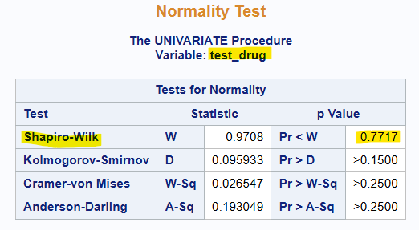
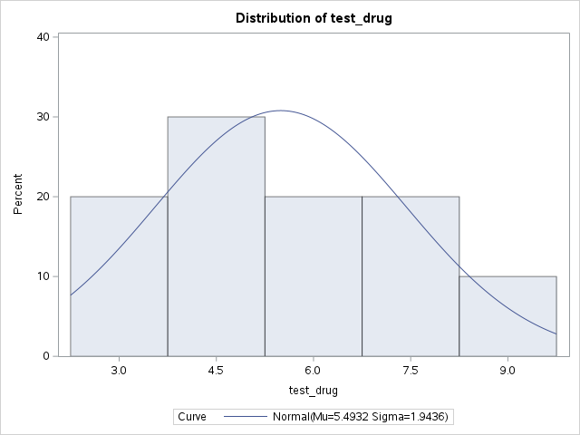
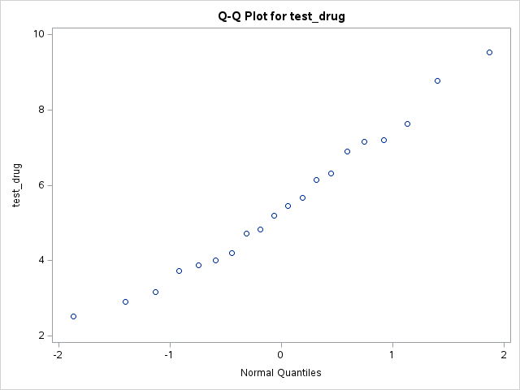
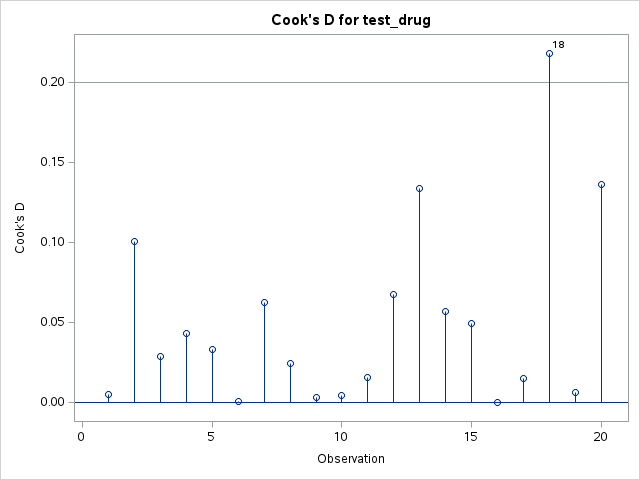
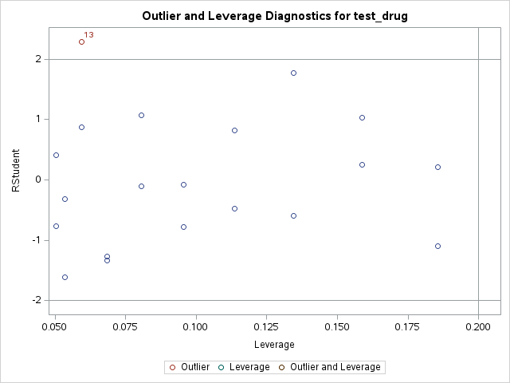
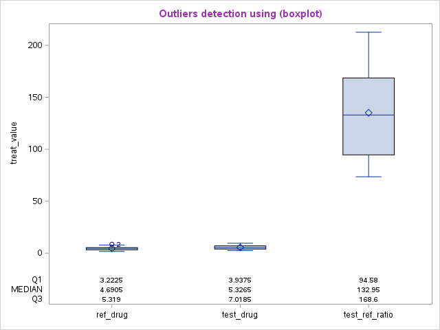
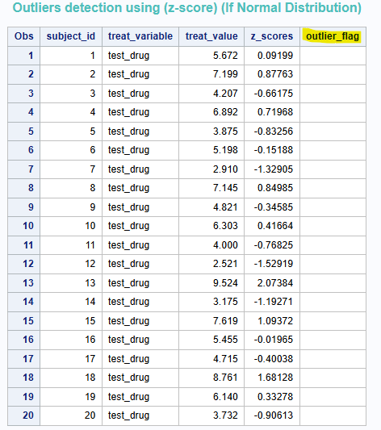

#### Version SAS

```
**Release: 3.81 (Enterprise Edition)**  

**Supported browsers:**

- Microsoft Internet Explorer 11
- Mozilla Firefox 21+
- Google Chrome 27+
- Apple Safari 6.0+ (on Apple OS X)

**Build date:** 27 Apr 2022 13:21:36 
**SAS release:** 9.04.01M7P08062020 
**SAS platform:** Linux LIN X64 5.14.0-284.30.1.el9_2.x86_64 
**Site name:** SAS ONDEMAND FOR ACADEMICS 
**Site number:** 70094220  

Copyright © 2012-2020, SAS Institute Inc., Cary, NC, USA.
```

### General idea

This techniques applied **for small data size** (about 12 to 50 records), so i don't know if it works for larger data.

I used 4 tests to diagnose outliers plus normality test, if the data is not normally distributed i will may z-scores test.

here I detect outliers visually or from tables.

Here is the used tests and their assumptions or notes:

| test                              | assumption             |
| --------------------------------- | ---------------------- |
| Z-score                           | Normal distribution    |
| Z-score                           | large zise (n>10)      |
| Boxplot (iqr)                     | skewed distribution    |
| Cook's Distance                   | Normal distribution    |
| Cook's Distance                   | errors are independent |
| studentized   residual (RSTUDENT) | Normal distribution    |
| studentized residual (RSTUDENT)   | constant variance      |

i may add more tests for *non-normal distribution* later. or may not.

it is not clear for me which test to trust yet, that because the diversity of results, and the diversity shape of data sets.

#### My Data

i use this fake data set:

| subject_id | test_drug | ref_drug | test_ref_ratio |
| ---------- | --------- | -------- | -------------- |
| 1          | 5.672     | 4.85     | 112.348        |
| 2          | 7.199     | 8.587    | 73.541         |
| 3          | 4.207     | 5.122    | 90.775         |
| 4          | 6.892     | 3.456    | 200.755        |
| 5          | 3.875     | 2.989    | 142.684        |
| 6          | 5.198     | 6.632    | 128.458        |
| 7          | 2.91      | 2.457    | 96.175         |
| 8          | 7.145     | 4.531    | 189.639        |
| 9          | 4.821     | 5.256    | 116.789        |
| 10         | 6.303     | 3.768    | 164.432        |
| 11         | 4         | 4.889    | 92.984         |
| 12         | 2.521     | 1.633    | 166.973        |
| 13         | 9.524     | 7.847    | 170.226        |
| 14         | 3.175     | 2.964    | 79.593         |
| 15         | 7.619     | 5.144    | 187.456        |
| 16         | 5.455     | 4.182    | 147.841        |
| 17         | 4.715     | 3.897    | 105.772        |
| 18         | 8.761     | 5.382    | 212.593        |
| 19         | 6.14      | 6.04     | 85.372         |
| 20         | 3.732     | 2.889    | 137.447        |

### Diagnose each variable

#### test_drug:

Normality test:







This variable looks normally distributed.

Outliers detection tests:









only 2 of 4 tests showed 1 different outliers for each. also, these outliers look very close to the cutoffs (i mentioned the cutoff values in the SAS code below).

#### ref_drug:

Normality test: passed with p-value 0.6788: This variable looks normally distributed.

Outliers detection tests: i will make it short in this table:

| test     | id  |
| -------- | --- |
| cook's d | 2   |
| rstudent | 2   |
| rstudent | 13  |
| iqr      | 2   |
| z-scoer  | no  |

`subject id 2` diagnosed by 3 of 4 tests. also, `subject id 13` was very colse to the cutoff value.

#### test_ref_ratio:

Normality test: passed with p-value 0.3055: This variable looks normally distributed.

Outliers detection tests: i will make it short in this table:

| test     | id  |
| -------- | --- |
| cook's d | 4   |
| cook's d | 18  |
| cook's d | 19  |
| rstudent | no  |
| iqr      | no  |
| z-scoer  | no  |

`subject id 4,18, and 19` diagnosed by 1 of 4 tests. also, all were very colse to the cutoff value.

### Treat outliers

i will not treat them by myself, i will notify the data collector or the investigator about them. becuase the data size is small.

### SAS Code

here is the whole code:

it supposed to work with no problems, i put macros to modify it for any data set.

```sas
*** here i will diagnose outliers with 4 test plus a normality test ***
if the data is not normally distributed i may ignore z-scores test ***;

* fake data;
data Test_data;
input subject_id test_drug ref_drug test_ref_ratio;
datalines;
1 5.672 4.85 112.348
2 7.199 8.587 73.541
3 4.207 5.122 90.775
4 6.892 3.456 200.755
5 3.875 2.989 142.684
6 5.198 6.632 128.458
7 2.91 2.457 96.175
8 7.145 4.531 189.639
9 4.821 5.256 116.789
10 6.303 3.768 164.432
11 4 4.889 92.984
12 2.521 1.633 166.973
13 9.524 7.847 170.226
14 3.175 2.964 79.593
15 7.619 5.144 187.456
16 5.455 4.182 147.841
17 4.715 3.897 105.772
18 8.761 5.382 212.593
19 6.14 6.04 85.372
20 3.732 2.889 137.447
; run;


*** make macros ***;
%let data_set=Test_data; ***#put your data here#***;
%let id=subject_id; ***#put your id column here#***;
%let continuous_variables=test_drug ref_drug test_ref_ratio; ***#put your numeric columns here#***;

title "my data (Fake)";
proc print data=&data_set; run;
title; run;

title color=bio "Normality Test";
*** make normality tests ***;
proc univariate data=&data_set normal;
id &id;
ods select TestsforNormality histogram qqplot;
var &continuous_variables;
histogram &continuous_variables/normal;
qqplot &continuous_variables; run;
title;


title color=bip "Outliers detection using (cooksd, rstudentbyleverage)";
ods graphics on;
*** i used defult cutoffs
rstudent cutoff=+-3 and cutoff Cook's is 4/n ***;
proc reg data=&data_set plots(only label)=(cooksd rstudentbyleverage) ;
ODS SELECT CooksDPlot RStudentByLeverage;
id &id;
model &continuous_variables=&id; run;


*** transform data to make boxplot and z-score tests***;
%let treats= &continuous_variables;
%let length_treat=%sysfunc(countw(&treats));
data transformed;
    set &data_set;
    array treats &treats; * Create an array for the treatment variables;
    array treat_names{&length_treat} $ &treats; *Corresponding names for the array;
    do i = 1 to &length_treat; * Loop through each treatment variable;
        treat_variable = vname(treats{i}); * Get the name of the variable;
        treat_value = treats{i}; * Get the value from the treats array;
        output; * Output the transformed row;
    end;
    drop i &treats; * Drop the loop variable 'i' and transformed columns of treats;
run;

title color=bip "Outliers detection using (boxplot)";
*** make initial boxplot to get statistic data wtihout print it ***;
ODS SELECT NONE;
proc sgplot data=transformed;
    vbox treat_value/category=treat_variable DATALABEL=&id ;
    ods output sgplot=boxplot_data; run;
ODS SELECT all;

*** make data set from previous initial boxplot step***;
*** because i want to show "MEDIAN" "Q1" "Q3" values inside boxplot***;
data boxplot_statistics (keep = Value Statistic Category Subject);
    set boxplot_data 
    (rename=('BOX(treat_value,X=treat_vari___Y'n = Value
        'BOX(treat_value,X=treat_vari__ST'n = Statistic
        'BOX(treat_value,X=treat_vari___X'n = Category
        'BOX(treat_value,X=treat_vari__DL'n=Subject));
    where not missing(Value) and Statistic in("MEDIAN" "Q1" "Q3");  run;

*** merge transformed data and the initial boxplot data ***;
data transformed_and_statistics;
    set transformed boxplot_statistics; run;

*** make second boxplot contains statistic data ***
*** i used defult cutoffs of boxplot. nearoutliers(outlier): lower=q1-1.5*iqr, upper=q3+1.5*iqr. faroutlier(faroutlier): lower=q1-3*iqr, upper=q3+3*iqr.
*** to understand how the outliers calculated visit SAS Support web-site here: https://support.sas.com/documentation/cdl/en/grstatproc/62603/HTML/default/viewer.htm#vbox-stmt.htm;
proc sgplot data=transformed_and_statistics;
    vbox treat_value / category=treat_variable DATALABEL=&id;
    xaxistable Value / x=Category class=Statistic location=inside;
    xaxis display=(nolabel); run;

*** extract outliers from the initial boxplot data again, to make table of the boxplot's result ***;
data outliers (keep = Subject Category Value Statistic);
    set boxplot_data
    (rename=('BOX(treat_value,X=treat_vari___Y'n = Value
        'BOX(treat_value,X=treat_vari__ST'n = Statistic
        'BOX(treat_value,X=treat_vari___X'n = Category
        'BOX(treat_value,X=treat_vari__DL'n=Subject));
    where find(Statistic, "OUTLIER") gt 0;
run;

*** make table of subjects and outliers determination (boxplot) ***;
proc sql;
create table result_boxplot as
   select transformed.*, outliers.Statistic
   from transformed left join outliers on transformed.treat_variable=outliers.Category and transformed.treat_value=outliers.value and transformed.&id=outliers.subject 
   order by transformed.&id, transformed.treat_variable; QUIT;
proc print data=result_boxplot; run;

title color=bibg "Outliers detection using (z-score) (If Normal Distribution)";
*** create new variable that shows z-scores for each raw data value***;
*** z-score cutoff=+-3;
proc sql;
create table result_Zscores as
    select transformed.*, (treat_value - mean(treat_value)) / std(treat_value) as z_scores, case when (treat_value - mean(treat_value)) / std(treat_value) NOT BETWEEN -3 AND 3 THEN "Outlier" ELSE "" END AS outlier_flag
    from transformed
    group by treat_variable
    order by &id, treat_variable;quit;
proc print data=result_Zscores; run;
```

### Done

please correct my misunderstand in this topic if there is any.

bye

### references

[Dealing with outliers using the Z-Score method - Analytics Vidhya](https://www.analyticsvidhya.com/blog/2022/08/dealing-with-outliers-using-the-z-score-method/)

[So many ways for assessing outliers: What really works and does it matter? - ScienceDirect](https://www.sciencedirect.com/science/article/pii/S0148296321002290)
