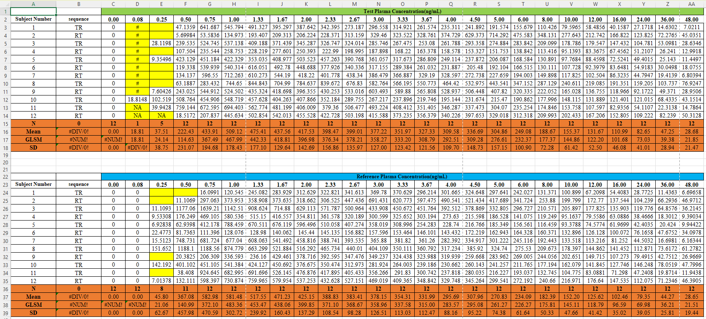
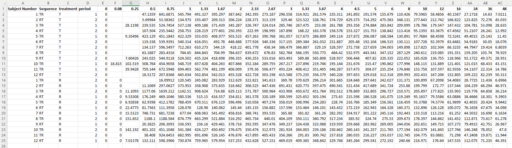
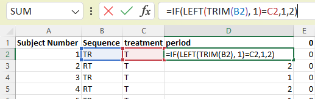
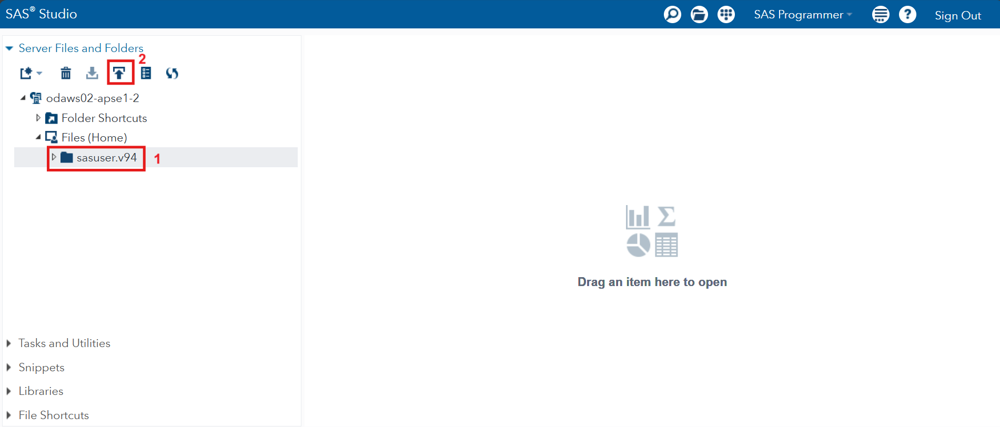
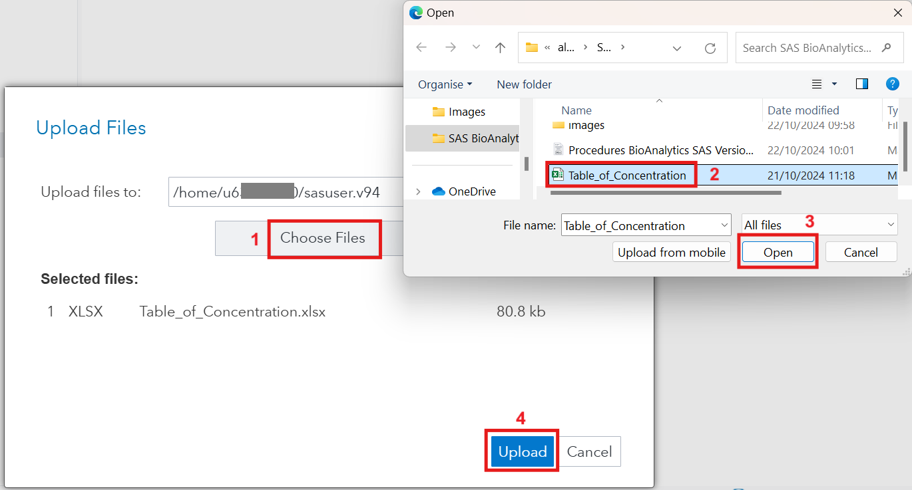
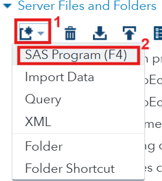
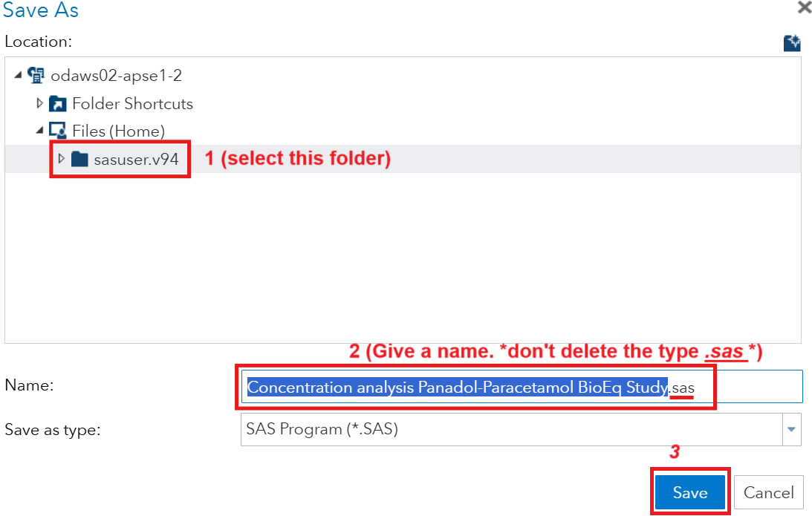

### Standard operating procedure (SOP): BioEquivalence Statistical Analytics of 2x2 cross over study using SAS Software

____

### Before start: This Note's info

**Department:** Statistics.

**Project:** Bioequivalence. 

**Last Update:** 21/Nov/2024

**Version:** 4.0

**Is it an official copy?** No, This is a <u>draft copy</u>.

**Edited by:** Fatimah in 21/Nov/2024.

___

**Editor notes 4/Nov/2024:**

1. This copy of SOP'S uses a personal account of <u>[SAS OnDemand For Academics](https://welcome.oda.sas.com/)</u>. This account is a 1 year free trail, now it is 6 months remaining. (version info: 
   
   ```
     Release: 3.81 (Enterprise Edition)
     Build date: 27 Apr 2022 13:21:36  
     SAS release: 9.04.01M7P08062020  
     SAS platform: Linux LIN X64 5.14.0-284.30.1.el9_2.x86_64  
     Site name: SAS ONDEMAND FOR ACADEMICS  
     Site number:70094220
   ```
   
   )

2. This copy of SOP'S uses a work account of MicroSoft Excel to manage <u>.xlsx</u> files. (version info: 
   
   ```
   Microsoft® Excel® for Microsoft 365 MSO (Version 2305 Build 16.0.16501.20074) 64-bit 
   ```
   
   )

3. All shown sensitive data in this note is fake (concentrations also faked), but have same appearance.

4. This note suitable for 2 sequences x 2 period cross over study.

5. These procedures need prior knowledge and  basic skills about programming debugging (at least Python *or* SAS *or* R...etc).

6. You need internet.

7. I advice you to have some basic information of SAS interface. (less than 1 hour to learn about it, its free in internet).

8. Each code is related to a previous procedure's code.

9. I am not sure about my calculations (I did not validate them yet).

10. I am wondering why i should calculate the AUC_0inf? is it prediction? i don't know 

____

##### Definitions:

**PI:** Principal Investigator.

**PK:** Pharmacokinetics.

___

### Procedures

#### 0. Prepare folder of raw files

**0.1** Make copy of any file you receive and store the original and the copy in folder of raw files for the specific study with version number. (example folder name: /raw files of Panadol-Paracetamol BioEq Study/).

**0.2** Organize your files with meaningful names and versions with dates of edits 

**0.3** Write <u>.txt</u> file that describe the folder contents and ideas and any important info in detail. (example folder name: /raw files of Panadol-Paracetamol BioEq Study/info.txt).

____

#### 1. Have SAS Software and .xlsx manager software

**1.1** Get your own work <u>username</u> and <u>password</u> from licensed account of SAS software by your company.

**1.2** Prepare a tool to manage <u>.xlsx</u> files (examples: *Microsoft Excel*, *Google Sheets*. **DO NOT** use personal accounts! only your work licenced accounts).

____

#### 2. Data pre-processing (preparing data using Excel)

**2.1** You supposed to receive the data in this form or similar in <u>.xlsx</u> file type: 



**2.2** `Time-Point` columns **most NOT** contain empty value, symbols, strings, nor Characters, **Only** numbers. (example: see *yellow* cells in [figure: raw data]). If it contains unacceptable values contact the *PI*. **DO NOT** Edit them without a permission via formal Email from the *PI* (WhatsApp, Call, Speech, Face to face,...etc. Are **NOT** acceptable, **ONLY** Email).

**2.3** Rearrange the data in a proper form as structured table, without descriptive statistics. (example: see *orange* cells in [figure: raw data]).

**2.4** Raw data most contains these info: `subject number`, `sequence`, `treatment`(test drug, reference drug), `time-points`. If the raw data missing any of them, you **CAN NOT** do analysis, ask *PI* to receive the data again with complete info.

**2.5** Clean data supposed to be like this table: (`period` could be generated by you, if did not received in the raw data)



**2.6** Generate new column named `period` from `sequence` and `treatment` using a correct formula. (example: ). This column describes the period of the drug have been taken in.

**2.7** Make sure to type a proper column names, here the `subject number` is wrong, make it `subject_number`, replace the space with underscore.  

____

#### 3. Importing cleaned data to SAS and environment preparing

**3.1** Import cleaned data type <u>.xlsx</u> file into SAS environment. 

1. Get into your SAS account <u><a href="https://welcome.oda.sas.com/">SAS OnDemand For Academics</a></u> >> select folder `sasuser.v94` >> click import icon>> [see figure: SAS import .xlsx file]
       
   

2. Drop down the folder `sasuser.v94`, find our <u>.xlsx</u> file then copy its path from its properties.
   

3. Open new SAS page and save it to name it (ctrl+s).
   

4. Now you can write SAS codes. follow this code and read my comments that explain every line

5. To run any line or any couple of lines, or all page: select the lines>>click the <u>runner-man icon</u>.
   
   ```sas
   /* import .xlsx file into this workspace */
   libname lib03 XLSX "/home/u6******0/sasuser.v94/Table_of_Concentration.xlsx"; * paste the copied path;
   
   /* copy the data into 'work' library, by importing the worksheet name, mine is:TOC_clean */
   data work.my_data;
       set lib03.'TOC_clean'n;
       * you can filter subjects in this step using this line for Example: ; 
        Where 'subject number'n not eq 4;
   run;
   ```

6. **What if you faced Errors?** read them and figure out your mistakes or copy the error and paste it in browser search and find the solution (use your debugging skills).

7. **If a `subject` is missing in any period**, **Do Not** include hem in the analysis, and inform the PI about that and note it in your report. Some analysts does not note that, discuss with your *PI*.

____

#### 4. Prepare variables

**4.1** Do macros to make it easy when you call variables in the SAS-Procedures(proc).

**4.2** Transform `Time points` columns to 2-columns named `Time_point` and `concentration_value`, that to apply the PROCs easily with correct analysis. 

```sas
/* make macro for each neaded variable */
%let my_data=my_data;
%let subj=subject_number;
%let count_subjects=12;
%let sequ=sequence;
%let trt=treatment;
%let prd=period;
%let parameters='0'n '0.08'n '0.25'n '0.5'n '0.75'n '1'n '1.33'n '1.67'n '2'n '2.33'n '2.67'n '3'n '3.33'n '3.67'n '4'n '4.5'n '5'n '6'n '8'n '10'n '12'n '16'n '24'n '36'n '48'n;
* these are the time points from the data;

transform time-points into one columns;
%let length_parameters=%sysfunc(countw(&parameters, %str('n ')));
data transformed;
    set &my_data;
    array parameters &parameters;
    * Create an array for the parameters;
    array parameters_names{&length_parameters} $ &parameters;
    * Corresponding names for the array;

    do i=1 to &length_parameters;
        j=i+1;
        * Loop through each parameter;
        time_point=input(strip(vname(parameters{i})), 8.);
        concentration_value=input(strip(parameters{i}), 8.);
        if j=<&length_parameters then do
            lead_value=input(strip(parameters{j}), 8.);  * needed for interpolation, next steps;
            lead_time=input(strip(vname(parameters{j})), 8.);
        end;
        else if j>&length_parameters then do; lead_value=.; lead_time=.; end;
        log_concentration_value=log(concentration_value); * needed to find the slope, next steps;
        output; * Output the transformed row;
    end;
    drop i j &parameters; * Drop the loop variables 'i,j' and transformed parameters;
run;

* you may need this in case if some parameters are recognized as character type while they are numeric actually;
/* data transformed; */
/* set transformed; */
/*     id = input(&subj, 8.); */
/*     num_&prd = input(&prd , 8.); */
/*     drop &subj &prd; */
/*     rename id = &subj num_&prd = &prd; */
/* run; */

proc sort data=transformed; * sort the data, it is needed for next steps;
    by &subj &sequ &trt &prd;* I call a macro after '&' sign;
run;
```

##### sub 4. Check missing concentrations, and missing subject

```sas
***************************** check missings *************************;
proc sort data=transformed nodupkey out=distinct_&trt; by &trt; run;
data subjects (keep=&subj &trt); * make index for subjects;
   set distinct_&trt; 
do &subj = 1 to &count_subjects; by &trt; 
output; end; run;

proc sql; * count subjects per treatment;
    create table treatment_counts as
    select &trt, count(distinct &subj) as count_subjects
    from transformed group by &trt; quit; run;

proc sql; * Identify missing subjects for each treatment;
    create table missing_subjects as
    select distinct  a.&trt as missing_&trt, a.&subj as missing_&subj
    from subjects as a
      full join transformed as b on a.&subj = b.&subj and a.&trt = b.&trt
    where b.&subj is null order by b.&trt, a.&subj desc; ;quit; run;
* Display the counts per treatment, mention missing subjects in each treatment, and missing concentrations;
proc print data=treatment_counts; title "Subject Counts by Treatment"; run;
proc print data=missing_subjects; title "Missing Subjects by Treatment"; run; title; run;
proc print data=transformed (keep=&subj &sequ &trt &prd concentration_value time_point); 
where concentration_value is null;
title "missing concentrations"; run; title; run;
```

____

#### 5. Calculations

**5.0** You need some calculations like C_max, AUC, T_max, AUC_tail, AUC_0inf, and log...etc. Actually my calculation are not surely correct since i did not work on real project and did not get validation yet.

**5.1 Slope** You need to find the slope to use it in your calculations of interpolation, and AUC_tail. Use semi logarithmic slope of the points after Cmax (this slope called Lambda_z): (t_2-t_1)/log(c_2-c_1). The linear slope will give bad results. Also it is important to get negative slope (positive slope means failed model in this study), I use Adjusted R-square in the regression model (check the regression result to see all slopes  in negative, the `_EDF_` shows the numbers of points included to get best fit). Remember to exclude zeros and negative values before the regression (only for the regression step, then give them back), these values will effect the slope badly.

```sas
********************************** find slope;
********lambdaZ= (slope of (concentration) and time) i got the slope from regression for last few time points after t_max depending on the Adjusted R-square;
* it is needed for interpolation and for the AUC_tail, AUC_inf;
* create function that let you choose the intervel (all given points, or points lies after cmax point) and type fo slope (linear which is bad one since it gives bad results, logarithem which is the good one);
%macro choose_slope(interval, type); 
    %if &interval = after %then %do;
        %let choice=and (a.time_point > b.t_max); %end;
    %else %if &interval = all %then %do;
        %let choice=; %end;
    %else %do;
        %put Invalid input. Please enter either 'after' or 'all.'; %end;
         %if &type = log %then %do;
        %let dependent=log_concentration_value; %end;
    %else %if &type = linear %then %do;
        %let dependent=concentration_value; %end;
    %else %do;
        %put Invalid input. Please enter either 'log' or 'linear.'; %end;
        proc sql ; * filter data by exclude time points less than t_max, if you choose 'after';
            create table find_slope_exclude_points as
            select a.*,  b.t_max
            from transformed as a
            right join (select  &subj, &sequ, &trt, &prd, max(concentration_value) as cmax, case when concentration_value=max(concentration_value) then time_point end as t_max 
                            from transformed group by &subj, &sequ, &trt, &prd
                            having t_max is not null) as b
            on a.&subj = b.&subj and a.&sequ = b.&sequ and a.&trt = b.&trt and a.&prd = b.&prd 
             &choice ;quit; run;

        proc rank data=find_slope_exclude_points descending out=find_slope_exclude_points; * i use PPROC RANK, because the PROC SQL does not support window_function();
            by &subj &sequ &trt &prd; var time_point; where (&> 0); ranks var1_rank; run; * zeros and negatives will effect the slop badly, so should be excluded;

        proc reg data=find_slope_exclude_points outest=find_slope noprint; * to find the slope from linear regression; 
            by &subj &sequ &trt &prd;
            model &dependent=time_point/selection=ADJRSQ; run;
        data find_slope; set find_slope; slope=(time_point);  run; * if you got positive slope, the model failed;
%mend choose_slope;

%choose_slope(interval=after,type=log); * call function. 'linear' gives bad result of slope, don't choose it!, i will keep it to let you compare and see by your self;
```

**5.1.1** Fill missed points before PK calculations.

```sas
********interpolation to fill missing middle points;
data interpolation;
set transformed;
        LagTime=LAG(time_point);
        LagValue=LAG(concentration_value);
        IF time_point=0 THEN DO;
            LagTime=0;
            LagValue=0;
        END;
        if concentration_value=. then do;
        concentration_value=(lagvalue+(abs((time_point-lagtime)/(lead_time-lagtime))*(lead_value-lagvalue)));
        end;
    by &subj &sequ &trt &prd; run;

********interpolation to fill missing last points;
proc sql; create table interpolation as 
select b.*, a.intercept, a.slope,
case when ((b.concentration_value=.) and (b.lead_value=.)) then abs(a.intercept-a.slope*b.time_point) else b.concentration_value end as concentration_value_2
from find_slope as a
full join interpolation as b 
on a.&subj = b.&subj and a.&sequ = b.&sequ and a.&trt = b.&trt and a.&prd = b.&prd
group by b.&subj, b.&sequ, b.&trt, b.&prd
order by  b.&subj, b.&sequ, b.&trt, b.&prd, b.time_point; 
quit; run;

data interpolation;
set interpolation;
drop concentration_value;
rename concentration_value_2=concentration_value;
log_concentration_value=log(concentration_value); run;
```

**5.2** Do *PK* calculations.

```sas
***************************** calculations *************************;
********************* camx, tmax, AUC_0t, AUC_tail, AUC_inf;
* calculate AUC using Trapezoid technique;
DATA auc_temp;
    SET interpolation;
    by &subj &sequ &trt &prd;
    Trapezoid=(time_point-LagTime)*(concentration_value+LagValue)/2;
/*     Trapezoid=(time_point-LagTime)*(concentration_value-LagValue)/log(concentration_value-LagValue); * i dont know if this what they meant by logarithmic AUC; */
RUN;

*calculat c_max, AUC_0t, t_max, auc_tail, auc_0inf and logs; 
proc sql;
    create table cmax_auc_tmax_temp as select &subj, &sequ, &trt, &prd, 
        max(concentration_value) as cmax, log(max(concentration_value)) as log_Cmax,
        sum(Trapezoid) as auc_0t, log(sum(Trapezoid)) as log_auc_0t,
        case when concentration_value=max(concentration_value) then time_point end as t_max 
        from auc_temp 
        group by &subj, &sequ, &trt, &prd
        having time_point is not null;
quit;
******************
AUC_(0-∞) = AUC_(0_t) + AUC_(tail)
AUC_(tail) = Ct/ lambdaZ.
lambdaZ= (slope of (concentration) and time) i got the slope from regression for last few time points after t_max.
Where Ct is the final concentration that can be detected and lambdaZ is the final elimination rate constant.
********************;
%choose_slope(interval=after, type=log); * call function;
proc sql;
    *Step 1: Find the last concentration value and its corresponding by finding the max time_point;
    create table auc_tail_temp as
    select  a.&subj, a.&sequ, a.&trt, a.&prd, a.time_point, a.concentration_value , abs(c.slope) as lambdaZ, abs(a.concentration_value / c.slope) as auc_tail, abs(log(abs(a.concentration_value / c.slope))) as log_auc_tail 
/*     * iam not sure if it could be correct also, i just get the slope of linear regression; */
    from auc_temp as a
     left join find_slope as c on c.&subj = a.&subj and c.&sequ = a.&sequ and  c.&trt = a.&trt and c.&prd = a.&prd
    having a.time_point=max(a.time_point); quit; run;

proc sql; create table calcs_summary_1 as select distinct a.*, b.auc_tail, b.log_auc_tail, a.auc_0t+b.auc_tail as auc_0inf, abs(log(a.auc_0t+b.auc_tail)) as log_auc_0inf
from cmax_auc_tmax_temp as a
full join auc_tail_temp as b on b.&subj = a.&subj and b.&sequ = a.&sequ and b.&trt = a.&trt and b.&prd = a.&prd
having t_max is not null; quit; run;

title color=red "Calculations Table summary";
proc print data=calcs_summary_1;
run;
title;
```

____

#### 6. Outliers detection

**6.0** Outliers are values at the extreme ends of a dataset. Some outliers represent true values from natural variation in the population. Other outliers may result from incorrect data entry, equipment malfunctions, or other measurement errors. 

**6.0.1** When you find outliers, report the *PI* about the outlier observation, with the used statistical test's result that appears it.

**6.1** You need to encode categorical variables to apply models.

```sas
*** make macros ***;
%let data_set=calcs_summary_1;
%let id=&subj;
%let categorical_variables=&sequ &trt; * select catigorical variables to encode them next step;
%let independent_variables=e_&sequ e_&trt &prd; * 'e_' means encoded;
%let dependent_variables=Cmax auc_0t auc_tail auc_0inf;

* encoding categorical variables, it is needed to apply models;
%macro label_encode(dataset,var);
   proc sql noprint;
     select distinct(&var)
     into:val1-
     from &dataset;
 select count(distinct(&var))  into:mx from &dataset;
 quit;
 data &dataset;
     set &dataset;
   %do i=1 %to &mx;
     if (compress(strip(&var), '() /') = compress("&&&val&i", '() /')) then e_&var=&i;
   %end;
   run;
 %mend;
%macro encode_list_variables(dataset, var_list);
   %let var_count = %sysfunc(countw(&var_list));
   %do j = 1 %to &var_count;
     %let var = %scan(&var_list, &j);
     %label_encode(&dataset, &var);
   %end;
%mend;

*use the function;
%encode_list_variables(&data_set, &categorical_variables);

proc sort data=&data_set; by &independent_variables; run;
```

**6.2** How to check the encoded category reference? It easy, i did not delete the reference category. So, you can matching them by row.

**6.3** Test the normality of data.

```sas
*** make normality tests ***;
title color=brown "Normality Tests";

proc univariate data=&data_set normal;
    by &independent_variables;
    id &id;
    ods select TestsforNormality histogram qqplot;
    var &dependent_variables;
    histogram &dependent_variables/normal;
    qqplot &dependent_variables;
run;
```

**6.4** Use `cooksd`, `rstudentbyleverage` tests to detect outliers.

```sas
title color=bip "Outliers detection using (cooksd, rstudentbyleverage)";
ods graphics on;
*** i used defult cutoffs: rstudent cutoff=+-2 and cutoff Cook's is 4/(n-p) ***;

proc reg data=&data_set plots(only label)=(cooksd rstudentbyleverage);
    ODS SELECT CooksDPlot RStudentByLeverage;
    by &independent_variables;
    id &id;
    model &dependent_variables=&independent_variables;
run;
title;
```

**6.5** Also, use another test called `IQR` to detect outliers. (i'll mention it later)

**6.5.1** You need to transform data again. A column for needed parameters names (cmax, auc,...etc) and column for their values. 

```sas
*** transform data to make IQR and z-score tests***;
%let parameters= &dependent_variables;
%let length_parameters=%sysfunc(countw(&parameters));
data transformed_1;
    set &data_set;
    array parameters &parameters; * Create an array for the parameters;
    array parameters_names{&length_parameters} $ &parameters; * Corresponding names for the array;
    do i = 1 to &length_parameters; * Loop through each parameter;
        parameter_name = vname(parameters{i}); * Get the name of the variable;
        parameter_value = parameters{i}; * Get the value from the parameters array;
        output; * Output the transformed row;
    end;
    drop i &dependent_variables; * Drop the loop variable 'i' and transformed columns of parameters;
run;
proc sort data=transformed_1; by parameter_name &independent_variables; run; * needed step to avoid error in following steps;
```

**6.5.2** Here is the IQR test, This test is suitable for normal-distributed and skewed data too.

```sas
title color=bip "Outliers detection using (iqr)";
proc univariate data=transformed_1 noprint;
    by parameter_name &independent_variables;
    var parameter_value;
    output out=quartiles pctlpre=Q pctlpts=25, 75;
run;
data bounds_temp;
    set quartiles;
    IQR = Q75 - Q25; /* Calculate IQR */
    Lower_Bound_iqr = Q25 - 1.5 * IQR; /* Lower bound */
    Upper_Bound_iqr = Q75 + 1.5 * IQR; /* Upper bound */
run;
data iqr_results; * a merge step, here is the ooutliers detection;
    merge bounds_temp transformed_1; /* Get bounds */
    by parameter_name &independent_variables;
    if parameter_value < Lower_Bound_iqr or parameter_value > Upper_Bound_iqr then outlier = 'outlier';
    else outlier = '';
run;
proc print data=iqr_results; run;
```

**6.6** Also, use another test called `z-score` to detect outliers, this test highly sensitive to the mean, so if the data is not normally distributed, i prefer to ignore it. This test usually shows one outlier for each group.

```sas
title color=bibg "Outliers detection using (z-score)";
*** create new variable that shows z-scores for each raw data value***;
*** z-score cutoff=+-3;
proc sql;
create table result_Zscores as
    select transformed_1.*, (parameter_value - mean(parameter_value)) / std(parameter_value) as z_scores, case when (parameter_value - mean(parameter_value)) / std(parameter_value) NOT BETWEEN -3 AND 3 THEN "Outlier" ELSE "" END AS outlier_flag
    from transformed_1
    group by parameter_name, &sequ, &trt, &prd
    order by parameter_name, &sequ, &trt, &prd, &id;quit;
proc print data=result_Zscores; run;
```

**6.7** When you find more than three tests detected same outliers, or found a test that shows a very strong outliers, you can classify them as outliers.

**6.8** When you have outliers tell to the *PI*, and analyse your data **with** and **without** the outliers, and report your analysis with and without the outliers.

____

#### 7. Statistical Analysis

**7.1** I give you 2 ways to apply analysis tests, `PROC GLM` and `PROC MIXED`, you can compare each results to improve the code since I have not worked in real study yet.

**7.2** Prepare macros. [see 5.2 to calculate the logs of target parameters]

```sas
*make macro;
%let data_set=&data_set;
%let categ_variables= &SUBJ &sequ &PRD &TRT; * these are important, the code will not work without them;
%let log_paramerts_variables=log_cmax log_auc_0t log_auc_0inf; * needed parameters should be converted to log;
ods graphics off; * no need for test's graphs;
```

**7.3** Apply `PROC GLM`. And its `POWER`.

```sas
PROC GLM DATA=&data_set;
CLASS &categ_variables;
 MODEL &log_paramerts_variables = &sequ &SUBJ(&sequ) &PRD &TRT/ss3; * 'ss3' option tells SAS to use Type III sums of squares in the analysis, useful for balanced or unbalanced designs;
 RANDOM &SUBJ(&sequ) /TEST; *  &SUBJ(&sequ) is a random effect in the model, which accounts for variability between subjects in the analysis, 'TEST' option requests an F-test for the random effect;
 TEST H = &SEQU E = &SUBj(&SEQU); * The TEST statement is used to perform a hypothesis test, It tests the null hypothesis (H) about the effects of &SEQU and the random effects (E) of &SUBJ(&SEQU);
 LSMEANS &TRT / DIFF=CONTROL("R") CL stderr ALPHA=0.1 ; * option specifies that differences should be calculated relative to the control level, CL requests confidence limits for the least squares means, and ALPHA=0.1 sets the confidence level at 90%;
 ODS OUTPUT LSMeanDiffCL=LSMD OverallANOVA=MSE;

data MSE (keep=ms source dependent);
set MSE; where source = 'Error'; run;
proc sql; create table LSMD_MSE as select a.*, b.* from LSMD as a left join MSE as b on a.dependent=b.dependent; quit; run;
DATA LSMD (drop=source);set LSMD_MSE;
 GeoMRPointEstimate_ratio = EXP(DIFFERENCE); * calculates the geometric mean of the difference for each treatment contrast by taking the exponential of the DIFFERENCE (which was logged);
 GeoMRPointEstimate_LL = EXP(LowerCL); *  lower confidence limit for the geometric mean;
 GeoMRPointEstimate_UL = EXP(UpperCL); *  upper confidence limit for the geometric mean;
 iscv= sqrt(EXP(MS)-1); * This line calculates the coefficient of variation (expressed as a percentage) for the mean square error;

* calculate the power and print results;
%macro runPowerAnalysis(geo_iscv_data); * make a function that run a loop of power calculation;
        * calc power;
        proc sql noprint; * make macros for needed colculations in the proc power, in this macros i make lists to apply them as loop;
            select GeoMRPointEstimate_ratio into :GMRPE separated by ' ' from &geo_iscv_data;
            select iscv into :iscv_ separated by ' ' from &geo_iscv_data;
            select count(distinct &subj) into :ntotal from &my_data;quit; run;
        proc power ; 
        ods select none;
             twosamplemeans test=equiv_ratio 
             lower = 0.80
             upper = 1.25
             meanratio = &GMRPE
             cv= &iscv_
             NPERG=&ntotal
             power = .
             alpha=.05;
            ; ods output output=power; run; title;
            ods select all;
    proc sql noprint; create table power_&geo_iscv_data as select distinct a.*, b.NperGroup, (b.power*100) as power_100
    from &geo_iscv_data as a
    left join power as b on (round(a.GeoMRPointEstimate_ratio,.001)=round(b.meanratio,.001)) and (round(a.iscv,.001)=round(b.cv,.001)); quit; run;
    PROC PRINT DATA=power_&geo_iscv_data; RUN;

%mend runPowerAnalysis; * close the function (macro);
%runPowerAnalysis(LSMD); * call the function;
```

**7.4** Apply `PROC MIXED`. And its `POWER`.

```sas
%macro run_mixed(data_set, categ_variables, paramerts_variables); * make a function that run a loop of MIXED calculations;
    %let num_vars = %sysfunc(countw(&paramerts_variables));
    %do i = 1 %to &num_vars;
        %let current_var = %scan(&paramerts_variables, &i);
        PROC MIXED DATA=&data_set;
          TITLE "--- Mixed for &current_var ---"; 
            CLASS &categ_variables;
            MODEL &current_var = &sequ &prd &TRT;
            random &subj(&sequ); * This accounts for variability the subject within sequence;
            LSMEANS &trt/PDIFF; * 'PDIFF' option requests pairwise differences between the least squares means, which can help identify differences in treatment effects;
            ESTIMATE 'R VS T1' &TRT -1 1 0 /CL ALPHA=0.1; * It compares the treatment represented by T="1" against the control represented by R="-1" for the levels of &TRT, that becuase the R precedes the T in sorted code, CL option requests confidence limits for this estimate, and ALPHA=0.1 specifies that the confidence level should be set at 90%;
            ODS OUTPUT ESTIMATES=ESTIM CovParms=CovParms; RUN; * ESTIM for the estimates of the contrasts, CovParms for the covariance parameters associated with the random effects in the model;

        proc sql noprint; * Residual Estimate is the within-subject (or intra-subject) variability;
            select Estimate into :Residual
            from CovParms
            where CovParm = "Residual"; quit; 

        DATA ESTIM; 
            SET ESTIM;
            GeoMRPointEstimate_ratio= EXP(Estimate);
            GeoMRPointEstimate_LL = EXP(Lower);
            GeoMRPointEstimate_UL = EXP(Upper); 
            iscv= sqrt(EXP(&Residual)-1); RUN;

         TITLE "Estimates for &current_var";  
            %runPowerAnalysis(ESTIM); title; * recal created power function;

     %end; * end of loop;
%mend run_mixed; * close the function (macro);
%run_mixed(&data_set, &categ_variables, &log_paramerts_variables); *Call the function with your parameters;
```

____

#### 8. Report results

**8.1** Summary of *PK* parameters of *Paracetamol* (ng/mL) for Test Product (T) table, and another for Reference Product (R) table:

```sas
*********************** Summary Table ************************;
proc sort data=&data_set; by &trt; run;
proc means data=&data_set n mean std min median max noprint;
by &trt;
vars cmax auc_0t t_max auc_0inf;
output out=Summary; run; 
proc transpose data=summary (drop=_TYPE_ _freq_) name=varname out=summary;
by treatment;
id _STAT_; run;

ods graphics off;
proc surveymeans data=&data_set geomean UGMCLM LGMCLM alpha=.1;
by &trt;
var cmax auc_0t t_max auc_0inf;
ods output statistics=statistics_ geometricmeans=geomean_;
ods select statistics_ geomean_; run;
ods graphics on;

proc sort data=summary; by &trt varname; run;
proc sort data=statistics_; by &trt varname; run;
proc sort data=geomean_; by &trt varname; run;
data summary_2; merge summary statistics_ geomean_; by &trt varname;
title 'Parameters Summary by ' &trt;
proc print data=summary_2; run; title;
```

**8.2** Make 2 comparative graphs between treatments. one for linear mean, second for log mean.

```sas
**************************** comparitive graphs ****************;
ods graphics on; * remember to turn on the graphs if it have been turned off;
* Comparative mean linear graph;
proc sql; create table mean_values as select  &trt, time_point, avg(concentration_value) as concentration_value_means, avg(log(concentration_value)) as log_concentration_value_means
from transformed 
group by time_point, &trt; quit;
PROC sGPLOT DATA = mean_values; 
    series x=time_point y=concentration_value_means / group=&trt datalabel=concentration_value_means markers markerattrs=(symbol=circlefilled);
    xaxis label='Relative Time (hrs)'; yaxis label='concentration (ng/mL) mean';
    title 'concentration mean vs Time (hrs)'; 
RUN; title;
* Comparative mean semi(log) graph;
PROC sGPLOT DATA = mean_values; 
    series x=time_point y=log_concentration_value_means / group=&trt datalabel=log_concentration_value_means markers markerattrs=(symbol=circlefilled) ;
    xaxis label='Relative Time (hrs)'; yaxis label='log concentration (ng/mL) mean';
    title 'log concentration mean vs Time (hrs)'; 
RUN; title;
```

**8.3** Make 2 reports, one **without** outliers, second **with** outliers, and mention them in both reports, with used tests.

**8.4** Mention missing blood samples in a table: `Subject no.` , `Period`, `Time Point (hrs)`, but the `reason` will be filled by your *PI*.

**8.5** Mention Statistical Analysis tables (all) [See Procedures 7].

*(To be continued)*

##### sub 8. Graph individuals

**sub 8.1** If you want to see individual subject concentrations graph here is a function you can use. You may concern to see values before and after interpolation visually. 

```sas
**************************** graph indviduals;
%macro graph_individuals(id,type,period,data_set);
    %if (&subj <1) or (&subj > &count_subjects) %then %do;
        %put Invalid input. Please enter positive number between 1 and &count_subjects; %end;
     %if &type = log %then %do;
        %let dependent=log_concentration_value; %end;
    %else %if &type = linear %then %do;
        %let dependent=concentration_value; %end;
    %else %do;
        %put Invalid input. Please enter either 'log' or 'linear.'; %end;

    %if &period=all %then %do;
        %let period_1= (&prd ge 1); %end;
    %else %if &period ge 1 %then %do;
        %let period_1=(&prd in (&period)); %end;
    %else %if &period <1 %then %do;
        %put Invalid input. Please enter positive number or 'all.'; %end;

    proc sql; 
    create table values as select  &trt, time_point, concentration_value, log_concentration_value
    from &data_set 
    where &subj=&id and &period_1
    order by time_point, &trt; quit;
    PROC sGPLOT DATA = values; 
        series x=time_point y=&dependent / group=&trt datalabel=&dependent markers markerattrs=(symbol=circlefilled);
        xaxis label='Relative Time (hrs)'; yaxis label="&dependent (ng/mL)";
        title "&dependent vs Time (hrs), subject no.&id , periods no.&period"; 
    RUN; title;
%mend graph_individuals;
%graph_individuals(id=1,type=linear, period=2, data_set=transformed); * call the macro, it shows only one individual every call, you can build a loop by it;
```

____

#### 9. Validations

*(I have no idea how to validate the results yet)*

____

#### 10. References

- Intra-Subject Coefficient of Variation (CV%) for Sample Size Estimation for Crossover Design: https://onbiostatistics.blogspot.com/2014/03/intra-subject-coefficient-of-variation.html

- Bioequivalence data analysis [tcp.2020.28.e20](https://www.tcpharm.org/pdf/10.12793/tcp.2020.28.e20)

- [On Biostatistics and Clinical Trials: Cookbook SAS Codes for Bioequivalence Test in 2x2x2 Crossover Design](https://onbiostatistics.blogspot.com/2012/04/cookbook-sas-codes-for-bioequivalence.html)

- [AUC in Pharmacokinetics](https://pharmaeducation.net/auc-in-pharmacokinetics/)

- [Volume of Distribution – Pharmacokinetics](https://sepia2.unil.ch/pharmacology/parameters/volumeofdistribution/)

- [Calculating the Elimination Rate Constant | Certara](https://www.certara.com/knowledge-base/calculating-the-elimination-rate-constant/)

- [First Order Elimination Rate Constant and Half-life | A closer look - Lect 11](https://www.youtube.com/watch?v=De9999Jj-5Q)

- [Drug Pharmacokinetics (PK), Pharmacodynamics (PD) Study](https://www.nebiolab.com/introduction-to-pharmacokinetics-pk/)

- [Streamlining Non-compartmental Pharmacokinetic Analysis](https://www.certara.com/blog/tips-tricks-for-streamlining-non-compartmental-pharmacokinetic-analysis/)

- [Check lambda_z - PKANALIX](https://pkanalix.lixoft.com/check-lambda_z/)

- [Data processing and calculation rules - PKANALIX](https://pkanalix.lixoft.com/calculation-rules/)

- [351-2011: CONTRAST and ESTIMATE Statements Made Easy: The LSMESTIMATE Statement](https://support.sas.com/resources/papers/proceedings11/351-2011.pdf)

- [Calculation rules](https://monolixsuite.slp-software.com/pkanalix/2024R1/calculation-rules#Calculationrules-Differenceandratio)

- 

*(To be continued)*
