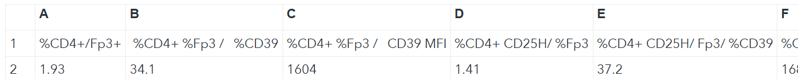
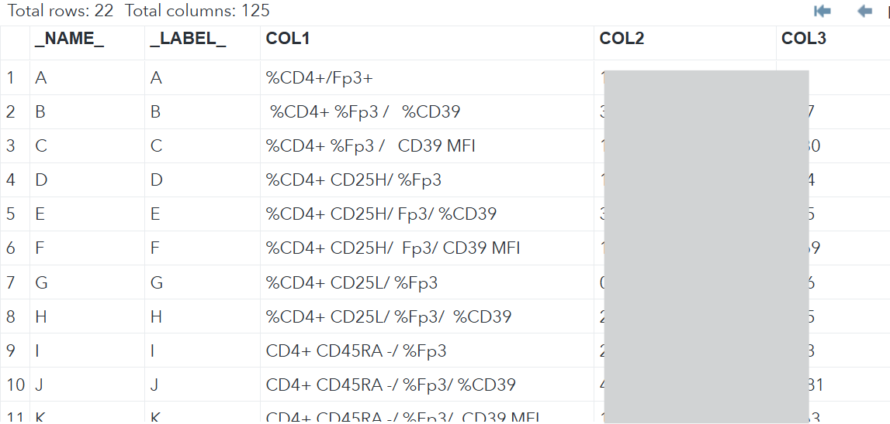
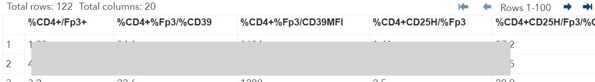
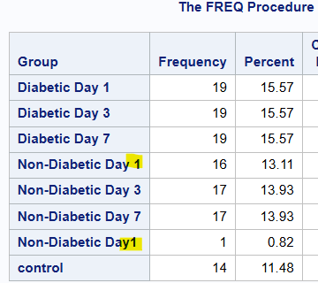
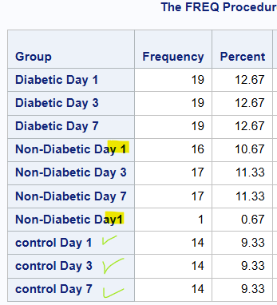
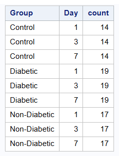
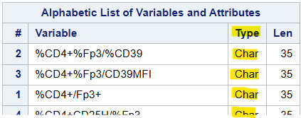
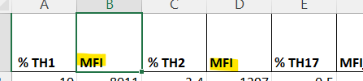
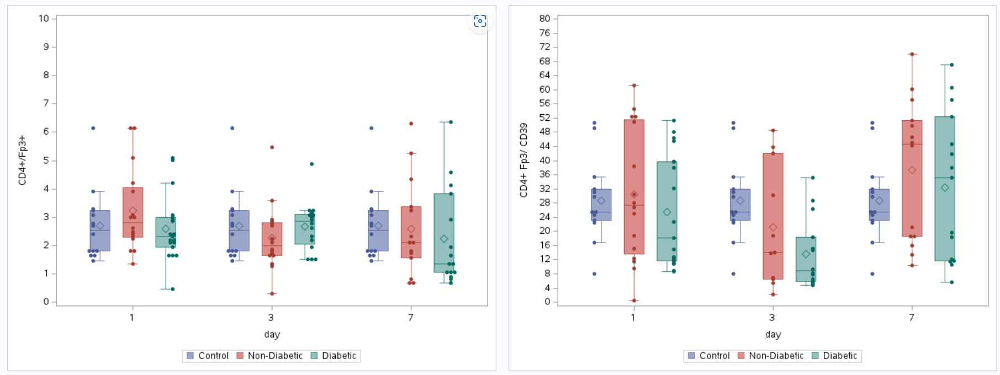
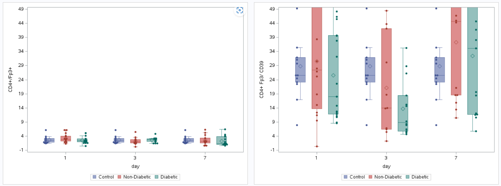

### Introduction

This notebook will explain the code, start from cleaning to visualizing. **Data Faked**

---

### Problems and Solution (cleaning)

1. column names have random multi spaces every where. so i will remove starts&ends space, and middle spaces. (all spaces delete). steps: import data with no header, then clean 1st row then make it as header.
   
   ```sas
   * Import file with no headers;
    proc import datafile = "/home/u6******0/sasuser.v94/visualization 9Dec2024/2nd Treg 1 and Treg 2.xlsx" 
    dbms=xlsx out=dataset replace; 
    sheet="Treg1";
    /* sheet="Treg 2"; */
    getnames=no; * it reads the variable names as a 1st row data, so the names will be A,B,C,....etc.;
    run;
   ```
   
    result:
    
   
    now the cleaning 1st row step:
   
   ```sas
   proc transpose data=dataset out=names ; var _all_; run;
   ```

    result:
    
    
    ```sas   
    data names;set names; col1=trim(strip(compress(col1))); run;
    proc transpose data=names(drop=_name_ rename=(col1=_name_)) out=dataset(drop=_name_ _label_);
    var col:;id _name_; run;
    
    ```
    result:
    

---

2. The researcher want to compare group `control` with the other groups in each day(you will see in the graph), so i just duplicate its values with deferent days. also separate days in a new column. original problem:
   
    
   
   ```sas
   data dataset;
   set dataset;
   group_=group;
   if group_ = "control" or group_ = "Control" then do;
   group = catx(" ", group_, "Day 1"); output;
   group = catx(" ", group_, "Day 3"); output;
   group = catx(" ", group_, "Day 7"); output;
   end;
   else do; output; end;
   drop group_;
   run;
   ```
   
    result:
   
    
   
    continue cleaning:
   
   ```sas
   data dataset; set dataset;
       if index(group, 'Day') > 0 then do; Day =input(%sysfunc(trim(%sysfunc(strip(%sysfunc(compress(scan(group, -1,'Day'))))))),best.); end; else do Day =group;end; 
       if index(group, 'Day') > 0 then do; group = scan(group, 1,' '); end; else do group =group;end; 
   group=propcase(group);run;
   ```
   
    result: 
    

---

### Start function (macro)

I created a function that works on each column i give. cleaning and customizing y-axis and graphing.

Problems list:

1. Based on cleaning column names we get numeric column types as character types.
   

2. I have no permission to edit column names, when there are common names, so sas reads them with suffixes automatically (example: col, col, col ---> col, col_1, col_2). so i will display them without suffixes (also, the researcher did not give me any Datainfo file).
   

3. since SAS reads space as separator, i will make `*` the separator (in given list).

4. In the y-axis i will insure the minor and major are displayed, because the max or min values are not displayed in graphs (some instances).

5. The researcher asked to remove `%`  from y-title of the graphs (don't ask me why). In my opinion its important keep `%` to describe the graph's numbers type.

---

```sas
/* create function (macro), if you have list of y variables use '*' as separator */
%macro boxplot_scatter(dataset,list_vars_numeric, groupby, category, y_start, y_end, y_by);
    %let list_length = %sysfunc(countw("&list_vars_numeric",%str(*))); * a counter to run the loop;
    %do j=1 %to &list_length; *start loop;
        %let var = %scan("&list_vars_numeric", &j, %str("*")); * corrent variable;
        %let xx=&category; 
        %let yy=%sysfunc(trim(%sysfunc(strip(%sysfunc(compress(&var))))));


        /* cleaning */
        %let y_label = %sysfunc(tranwrd(&yy,%,)); * remove % sign from y-axis label;
        %if (%index(&y_label, _) > 0) %then %do; %let y_label = %scan(&y_label, 1,_); %end;
        data &dataset; set &dataset; var=trim("&yy"n);var_num=input(trim(var),best.); run; * convert char. to num. type;
        %let yy=var_num;

        /*     calculations */
        %if &y_end=. %then %do; * max y-axis value, if not specified it will make nearest upper 10 (ex: 23-->30, 48-->50);
            proc sql noprint; select ceil(max("&yy"n)/10)*10 into:ymax from &dataset; quit; %end;
        %else %do; %let ymax=&y_end; %end;
        %if &y_start=. %then %do; * min y-axis value, if not specified it will make nearest lower 10 (ex: 23-->20, 48-->40);
            proc sql noprint; select floor(min("&yy"n)/10)*10 into:ymin from &dataset; quit; %end;
        %else %do; %let ymin=&y_start; %end; * difference between y-axis values;
        %if &y_by ne . %then %do; %let by=by &y_by; %end;
        %else %do; %let by= ; %end;


        proc sgplot data=&dataset;
            vbox "&yy"n / category=&xx group=&groupby MEANATTRS=(symbol=diamond) nooutliers transparency=0.3 name="vbox1" ;
            scatter x="&xx"n y="&yy"n  / group=&groupby groupdisplay=cluster jitter MARKERATTRS=(symbol=circlefilled size=5) name="scatter1";
            xaxis label="&xx";
            yaxis label="&y_label"
            values=(&ymin to &ymax &by)
            MIN=&ymin MAX=&ymax;
            keylegend "vbox1"/ position=bottom;
        run; %end;
%mend boxplot_scatter;
```

---

Call function:
i copied the names from excel using this function `=TEXTJOIN("*",TRUE,<range of needed column names>)`

```sas
%let list= %CD4+/Fp3+* %CD4+ %Fp3 /   %CD39;
%boxplot_scatter(dataset=dataset,list_vars_numeric=&list,category=day,groupby=group,y_start=., y_end=., y_by=.);
```

result:**(Data Faked)**


recall the macro with customizing y-axis major and minor (just to proof that you can zoom-in&out):

```sas
%let list= %CD4+/Fp3+* %CD4+ %Fp3 /   %CD39;
%boxplot_scatter(dataset=dataset,list_vars_numeric=&list,category=day,groupby=group,y_start=-1, y_end=50, y_by=5);
```

result:**(Data Faked)**


---

### Conclusion

i'am sure it may has mistakes, you can note me about them any time. 

Bye.
